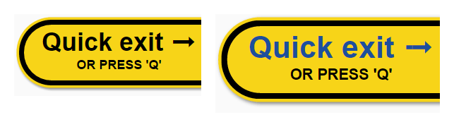
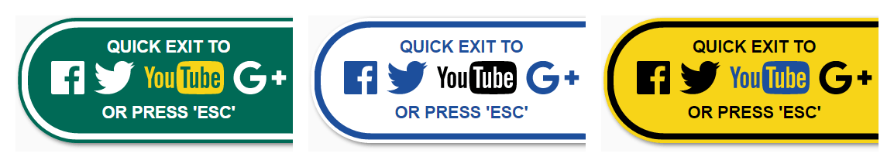

Quick exit button
=================

Button that sits on screen and provides a fast way for a user to exit the current website.
Intended to help users protect privacy. For example: when accessing information about domestic violence.

[](https://www.bithound.io/github/bboyle/quick-exit)
[](https://www.bithound.io/github/bboyle/quick-exit/gh-pages/dependencies/npm)
[](https://www.bithound.io/github/bboyle/quick-exit/gh-pages/dependencies/npm)



Features
--------

- clear page contents
- replace current URL with '/' 'Home' (requires [historyState](http://caniuse.com/#feat=history))
- load another "safe" website
- progressive enhancement

### HTML

- quickly exit site
- bust out of frames
- keyboard accesskey
- support for `Esc` as an access key using `data-accesskey="Esc"` on links
- display an accesskey message using `data-accesskey="Esc"` on the container
- add extra HTML content within the `#quick-exit` container
  - use `<header>` and `<footer>` for styled content above and below the links
  - use `<strong>` within the header or footer elements for **BOLD UPPERCASE** text.

```html
<div id="quick-exit">
    <a target="_top" href="http://www.google.com/">Quick exit ➟</a>
</div>
```

```html
<div id="quick-exit" data-accesskey="Esc">
    <a target="_top" href="http://www.google.com/" data-accesskey="Esc">Quick exit ➟</a>
</div>
```

- support for multiple exit links, with separate keyboard shortcuts

```html
<div id="quick-exit">
	<header>
		<strong>Quick exit to</strong>
	</header>
	<ul>
		<li><a target="_top" data-accesskey="Esc" href="https://www.facebook.com/"><svg viewBox="0 0 266.79999 266.89999"><path d="M252.1 0H14.7C6.6 0 0 6.6 0 14.7v237.4c0 8.1 6.6 14.7 14.7 14.7h127.8V163.5h-34.8v-40.3h34.8V93.5c0-34.5 21.1-53.2 51.8-53.2 14.7 0 27.4 1.1 31.1 1.6v36h-21.3c-16.7 0-20 7.9-20 19.6v25.7H224l-5.2 40.3h-34.7v103.4h68c8.1 0 14.7-6.6 14.7-14.7V14.7c0-8.2-6.5-14.7-14.7-14.7z"/></svg></a></li>
		<li><a target="_top" data-accesskey="t" href="https://twitter.com/"><svg viewBox="0 0 273.29999 222.3"><path d="M273.3 26.3c-10.1 4.5-20.9 7.5-32.2 8.8 11.6-6.9 20.5-17.9 24.7-31-10.8 6.4-22.8 11.1-35.6 13.6A55.92 55.92 0 0 0 189.3 0c-31 0-56.1 25.1-56.1 56.1 0 4.4.5 8.7 1.5 12.8-46.6-2.3-87.9-24.7-115.6-58.6-4.8 8.3-7.6 17.9-7.6 28.2 0 19.5 9.9 36.6 25 46.7-9.2-.3-17.8-2.8-25.4-7v.7c0 27.2 19.3 49.8 45 55-4.7 1.3-9.7 2-14.8 2-3.6 0-7.1-.4-10.6-1 7.1 22.3 27.9 38.5 52.4 39-19.2 15-43.4 24-69.7 24-4.5 0-9-.3-13.4-.8 24.8 15.9 54.3 25.2 86 25.2 103.2 0 159.6-85.5 159.6-159.6 0-2.4-.1-4.9-.2-7.3 10.9-7.9 20.4-17.8 27.9-29.1z"/></svg></a></li>
		<li><a target="_top" data-accesskey="g" href="https://plus.google.com/"><svg viewBox="0 0 22 14"><path d="M7 6v2.4h3.97c-.16 1.03-1.2 3.02-3.97 3.02-2.39 0-4.34-1.98-4.34-4.42S4.61 2.58 7 2.58c1.36 0 2.27.58 2.79 1.08l1.9-1.83C10.47.69 8.89 0 7 0 3.13 0 0 3.13 0 7s3.13 7 7 7c4.04 0 6.72-2.84 6.72-6.84 0-.46-.05-.81-.11-1.16H7zM22 6h-2V4h-2v2h-2v2h2v2h2V8h2"/></svg></a></li>
	</ul>
	<footer>
		<strong>Or press 'Esc'</strong>
	</footer>
</div>

```

### CSS

- easy to locate (fixed to right-edge of browser, next to scroll bar)
- 3 high contrast themes (based on road signs) for contrast with your visual design
  1. default (yellow on black with blue accent)
  2. `class="green"` (white on green with yellow accent)
  3. `class="blue"` (blue on white with black accent)
- focus/hover indication
- display accesskey hint
- `data-accesskey="Esc"` displayed as *OR PRESS 'Esc'* below links (you can also use `<footer><strong>` HTML)
- override text by setting the `content` property for `#quick-exit::after`



View [quick-exit.css](src/quick-exit.css)

### JavaScript

- clear page contents
- replace current URL with '/' 'Home' (mask back button behaviour)
- listen for accesskey (without modifiers)
- hide window.top frame contents (using opacity)
- hide window.top page title (using 'New Tab')
- runs immediately if possible (no delay for ready/load events)
- runs on ready/load if the quick exit element could not be located earlier
  (for faster initialisation, place the `script` link in the HTML after the quick exit element)

View [quick-exit.js](src/quick-exit.js)


Implementation advice
---------------------

1. Grab the CSS and JS from this repo

  - [quick-exit.min.css](dist/quick-exit.min.css)
  - [quick-exit.min.js](dist/quick-exit.min.js)

2. Link to both in your page:

  ```html
  <link rel="stylesheet" href="/quick-exit/quick-exit.min.css">
  <script src="/quick-exit/quick-exit.min.js"></script>
  ```

3. Copy and edit a quick exit button snippet. You can customise the links, header and footer messages (or any other content).

  ```html
  <div id="quick-exit" class="blue">
  	<header>
  		<strong>Quick exit to</strong>
  	</header>
  	<ul>
  		<li><a target="_top" data-accesskey="Esc" href="https://www.facebook.com/"><svg viewBox="0 0 266.79999 266.89999"><path d="M252.1 0H14.7C6.6 0 0 6.6 0 14.7v237.4c0 8.1 6.6 14.7 14.7 14.7h127.8V163.5h-34.8v-40.3h34.8V93.5c0-34.5 21.1-53.2 51.8-53.2 14.7 0 27.4 1.1 31.1 1.6v36h-21.3c-16.7 0-20 7.9-20 19.6v25.7H224l-5.2 40.3h-34.7v103.4h68c8.1 0 14.7-6.6 14.7-14.7V14.7c0-8.2-6.5-14.7-14.7-14.7z"/></svg></a></li>
  		<li><a target="_top" href="https://twitter.com/"><svg viewBox="0 0 273.29999 222.3"><path d="M273.3 26.3c-10.1 4.5-20.9 7.5-32.2 8.8 11.6-6.9 20.5-17.9 24.7-31-10.8 6.4-22.8 11.1-35.6 13.6A55.92 55.92 0 0 0 189.3 0c-31 0-56.1 25.1-56.1 56.1 0 4.4.5 8.7 1.5 12.8-46.6-2.3-87.9-24.7-115.6-58.6-4.8 8.3-7.6 17.9-7.6 28.2 0 19.5 9.9 36.6 25 46.7-9.2-.3-17.8-2.8-25.4-7v.7c0 27.2 19.3 49.8 45 55-4.7 1.3-9.7 2-14.8 2-3.6 0-7.1-.4-10.6-1 7.1 22.3 27.9 38.5 52.4 39-19.2 15-43.4 24-69.7 24-4.5 0-9-.3-13.4-.8 24.8 15.9 54.3 25.2 86 25.2 103.2 0 159.6-85.5 159.6-159.6 0-2.4-.1-4.9-.2-7.3 10.9-7.9 20.4-17.8 27.9-29.1z"/></svg></a></li>
  		<li><a target="_top" href="https://www.youtube.com/"><svg height="209.1" width="500.902" viewBox="0 0 500.90244 209.1"><path d="M351.6 0s-62.7 0-104.5 3c-5.8.7-18.6.8-29.9 12.6-9 9-11.9 29.5-11.9 29.5s-3 24.1-3 48.1v22.6c0 24.1 3 48.1 3 48.1s2.9 20.5 11.9 29.5c11.4 11.8 26.3 11.5 32.9 12.7 23.9 2.3 101.5 3 101.5 3s62.7-.1 104.5-3.1c5.8-.7 18.6-.8 29.9-12.6 9-9 11.9-29.5 11.9-29.5s3-24.1 3-48.1V93.2c.1-24-2.9-48.1-2.9-48.1s-2.9-20.5-11.9-29.5C474.7 3.8 462 3.7 456.2 3c-41.8-3-104.5-3-104.5-3h-.1zM227 35.2h63v19h-22v115h-20v-115h-21v-19zm128 0h18v43.7c5.8-7.2 12.4-11.3 19.1-11.3 7.2 0 12 4.2 14.5 11.6 1.2 4.1 2.4 10.5 2.4 20v40c0 9.2-.8 15.8-2 20-2.4 7.4-7.7 11.3-14.9 11.3-6.5 0-13.1-3.9-19.1-11.4v10.1h-18v-134zm93.7 32.6c9.1 0 16.3 3.7 21.4 10.5 3.8 5 5.9 12.8 5.9 23.5V122.4h-36.2v18c0 9.3 2.6 13.9 8.8 13.9 4.5 0 7.1-2.5 8.1-7.3.1-1 .1-5.3.1-12.6h19v2.8c0 5.9-.4 10-.6 11.8-.6 4-2 7.6-4.2 10.8-5 7.2-12.4 10.8-21.9 10.8-9.5 0-16.7-3.4-21.9-10.2-3.8-5-6.3-12.5-6.3-23.1v-35c0-10.7 2.3-18.9 6.1-24 5.2-6.9 12.5-10.5 21.7-10.5zM287 69.2h19v81c.4 2.8 1.6 3.8 4.1 3.8 3.6 0 6.9-3.2 10.9-8.8v-76h19v100h-19v-11c-7.2 8.3-13.3 12.4-20 12.4-5.8 0-9.9-2.8-11.9-7.7-1.2-3-2.1-7.8-2.1-14.7v-79zm95.4 15c-3 0-6.4 1.6-9.4 4.6v60.6c3 3.1 6.4 4.6 9.4 4.6 5.2 0 7.6-3.8 7.6-13.8V97.1c0-10-2.4-12.9-7.6-12.9zm66.2.1c-6 0-8.6 2.6-8.6 11.9v11h17V96.3c0-9.2-2.4-12-8.4-12z"/><g><path d="M187 169.2h-19v-11c-7.2 8.3-13.3 12.4-20 12.4-5.8 0-9.9-2.8-11.9-7.7-1.2-3-2.1-7.8-2.1-14.7v-80h19v82c.4 2.8 1.6 3.8 4.1 3.8 3.6 0 6.9-3.2 10.9-8.8v-77h19v101z"/><path d="M120 101.2c0-10.8-2.2-18.9-6-24-5.1-6.9-13-9.7-21-9.7-9.1 0-15.9 2.8-21 9.7-3.9 5.1-6 13.3-6 24.1v35.9c0 10.7 1.9 18.1 5.8 23.2 5.1 6.9 13.2 10.5 21.2 10.5s16.3-3.6 21.4-10.5c3.8-5.1 5.6-12.5 5.6-23.2v-36zm-19 38c1 10-2.1 15-8 15s-9-5-8-15v-40c-1-10 2.1-14.7 8-14.7s9 4.7 8 14.7v40z"/><path d="M45 114.2v55H25v-55S4.3 46.8 0 34.2h21l14 52.7 14-52.7h21l-25 80z"/></g></svg></a></li>
  		<li><a target="_top" href="https://plus.google.com/"><svg viewBox="0 0 22 14"><path d="M7 6v2.4h3.97c-.16 1.03-1.2 3.02-3.97 3.02-2.39 0-4.34-1.98-4.34-4.42S4.61 2.58 7 2.58c1.36 0 2.27.58 2.79 1.08l1.9-1.83C10.47.69 8.89 0 7 0 3.13 0 0 3.13 0 7s3.13 7 7 7c4.04 0 6.72-2.84 6.72-6.84 0-.46-.05-.81-.11-1.16H7zM22 6h-2V4h-2v2h-2v2h2v2h2V8h2"/></svg></a></li>
  	</ul>
  	<footer>
  		<strong>or press 'Esc'</strong>
  	</footer>
  </div>
  ```

### Customising the button

You can customise any part of the button.
Fork this repo and make your changes.
Sassy CSS source is available for the stylesheet.

#### Third-party brand guidelines

The quick exit button uses standard HTML links. You may wish to use recognisable brand icons as image links.
I have used some common social media brands as examples in this repo. Please read the brand guidelines carefully and decide whether it is appropriate for you to use their logos on your site.

- [Google+ icon branding guidelines](https://developers.google.com/+/branding-guidelines#google-icon-branding-guidelines)
- [Using the YouTube Logo](https://www.youtube.com/yt/brand/using-logo.html)
- [Guidelines for "f" Logo (Facebook)](https://www.facebookbrand.com/guidelines?asset=2&media=1)
- [Twitter brand guidelines](https://about.twitter.com/press/twitter-brand-policy)


### A note re frames

If the quick exit button is used inside frames it will:

- be placed on the right-hand edge of the frame (not browser window)
- not be able to exit correctly if the parent frame is on a different domain; see [https://en.wikipedia.org/wiki/Same-origin_policy](same-origin policy)

You can see this issue in play on the [codepen demo](http://codepen.io/bboyle/full/VaZqMb/).


### Disclaimer re privacy

This button does not provide any real privacy around browsing history.
It will let you quickly exit a site and makes it a little more difficult to "go back" and see what page was being viewed.

BUT:

- browsers still store your entire history
- other software can log what websites are visited, your keystrokes and more.
- physical cameras can capture what you are doing

Learn more at [SmartSafe (www.smartsafe.org.au)](http://www.smartsafe.org.au/)


Licence
-------

Available under [BSD-3-Clause](LICENSE).
