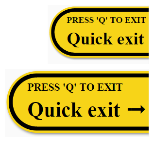

Quick exit button
=================

Button that sits on screen and provides a fast way for a user to exit the current website.
Intended to help users protect privacy. For example: when accessing information about domestic violence.

[](https://www.bithound.io/github/bboyle/quick-exit)
[](https://www.bithound.io/github/bboyle/quick-exit/gh-pages/dependencies/npm)
[](https://www.bithound.io/github/bboyle/quick-exit/gh-pages/dependencies/npm)

Features
--------

- clear page contents
- replace current URL with '/' 'Home' (requires [historyState](http://caniuse.com/#feat=history))
- load another "safe" website
- progressive enhancement

### HTML

- quickly exit site
- bust out of frames
- keyboard accesskey
- support for `Esc` as an access key using `data-accesskey="Esc"` on links
- display an accesskey message using `data-accesskey="Esc"` on the container
- display an optional message using `data-title="http://www.google.com"`

```html
<div id="quick-exit" data-accesskey="q" data-title="http://www.google.com/">
    <a target="_top" href="http://www.google.com/" accesskey="q">Quick exit ➟</a>
</div>
```

```html
<div id="quick-exit" data-accesskey="Esc">
    <a target="_top" href="http://www.google.com/" data-accesskey="Esc">Quick exit ➟</a>
</div>
```

- support for multiple exit links, with separate keyboard shortcuts

```html
<div id="quick-exit" title="Click for quick exit">
	<ul>
		<li><a target="_top" accesskey="f" href="https://www.facebook.com/"><svg viewBox="0 0 266.79999 266.89999"><path d="M252.1 0H14.7C6.6 0 0 6.6 0 14.7v237.4c0 8.1 6.6 14.7 14.7 14.7h127.8V163.5h-34.8v-40.3h34.8V93.5c0-34.5 21.1-53.2 51.8-53.2 14.7 0 27.4 1.1 31.1 1.6v36h-21.3c-16.7 0-20 7.9-20 19.6v25.7H224l-5.2 40.3h-34.7v103.4h68c8.1 0 14.7-6.6 14.7-14.7V14.7c0-8.2-6.5-14.7-14.7-14.7z"/></svg></a></li>
		<li><a target="_top" accesskey="t" href="https://twitter.com/"><svg viewBox="0 0 273.29999 222.3"><path d="M273.3 26.3c-10.1 4.5-20.9 7.5-32.2 8.8 11.6-6.9 20.5-17.9 24.7-31-10.8 6.4-22.8 11.1-35.6 13.6A55.92 55.92 0 0 0 189.3 0c-31 0-56.1 25.1-56.1 56.1 0 4.4.5 8.7 1.5 12.8-46.6-2.3-87.9-24.7-115.6-58.6-4.8 8.3-7.6 17.9-7.6 28.2 0 19.5 9.9 36.6 25 46.7-9.2-.3-17.8-2.8-25.4-7v.7c0 27.2 19.3 49.8 45 55-4.7 1.3-9.7 2-14.8 2-3.6 0-7.1-.4-10.6-1 7.1 22.3 27.9 38.5 52.4 39-19.2 15-43.4 24-69.7 24-4.5 0-9-.3-13.4-.8 24.8 15.9 54.3 25.2 86 25.2 103.2 0 159.6-85.5 159.6-159.6 0-2.4-.1-4.9-.2-7.3 10.9-7.9 20.4-17.8 27.9-29.1z"/></svg></a></li>
		<li><a target="_top" accesskey="g" href="https://plus.google.com/"><svg viewBox="0 0 22 14"><path d="M7 6v2.4h3.97c-.16 1.03-1.2 3.02-3.97 3.02-2.39 0-4.34-1.98-4.34-4.42S4.61 2.58 7 2.58c1.36 0 2.27.58 2.79 1.08l1.9-1.83C10.47.69 8.89 0 7 0 3.13 0 0 3.13 0 7s3.13 7 7 7c4.04 0 6.72-2.84 6.72-6.84 0-.46-.05-.81-.11-1.16H7zM22 6h-2V4h-2v2h-2v2h2v2h2V8h2"/></svg></a></li>
	</ul>
</div>

```

### CSS

- easy to locate (fixed to right-edge of browser, next to scroll bar)
- high contrast (based on warning road signs)
- focus/hover indication
- display accesskey hint
- `data-accesskey="q"` displayed as *PRESS 'Q' TO EXIT* above links
- `data-title="http://www.google.com" displayed a message below links
- override text by setting the `content` property for `#quick-exit::before` and `#quick-exit::after`



View [quick-exit.css](src/quick-exit.css)

### JavaScript

- clear page contents
- replace current URL with '/' 'Home' (mask back button behaviour)
- listen for accesskey (without modifiers)
- hide window.top frame contents (using opacity)
- hide window.top page title (using 'New Tab')

View [quick-exit.js](src/quick-exit.js)


Licence
-------

Available under [BSD-3-Clause](LICENSE).
